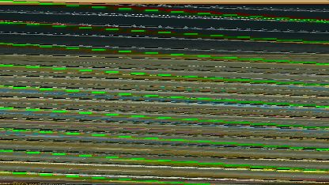

# the scary slope

Upon visiting [Steam partner broadcasts](https://steamcommunity.com/?subsection=broadcasts&browsefilter=partner_streams), I noticed a broken thumbnail, so I downloaded it:



At first glance, it seemed as though it was maybe:

- Interpreted with the wrong width
- Interpreted as RGB instead of YUV

I started with the "width" approach, but could not find integer
widths that "worked" (even in grayscale). My theory is that the image
was broken, _then_ resized. So I tried resizing before restoring it.

This repository contains code to play around with the thumbnails.

For reference, it should look something like:


## Usage

Install parcel globally:

```
npm install -g parcel
```

Install local dependencies

```
npm install
```

Run the local server:

```
parcel serve index.html
```

Then open http://localhost:1234 in a browser and play around with it.

Parcel provides hot reload (it watches for changes, recompiles, and
reloads the browser).

You can change `index.html` to use `thumbnail.jpg`, `thumbnail2.jpg`,
or `thumbnail3.jpg`.

I'm currently out of ideas. This is the best result I got:


It appears there's at least 3 frames mixed in every thumbnail. (Notice how
the brightest heart says '10', but the subtle one to the right of it says
'12'. There's also a third one to the left of the brightest one)

I'm releasing all this as open-source in case anyone wants to help elucidate
the mystery.

Good luck!
